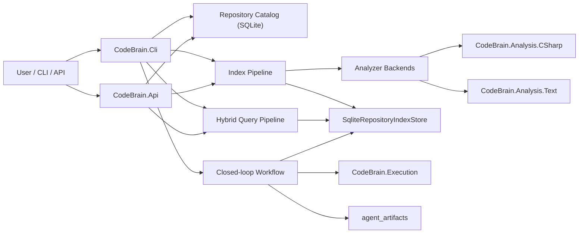
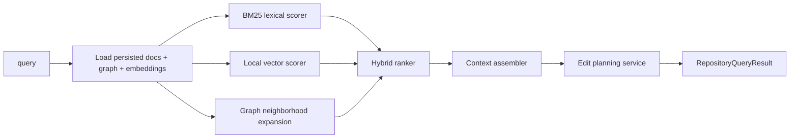
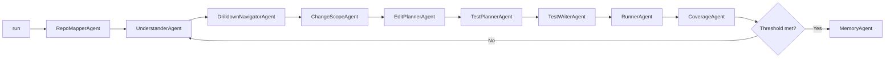

# CodeBrain Architecture

## Overview

CodeBrain now has three major execution paths that share the same persisted
repository intelligence model:

1. Index pipeline.
2. Query pipeline.
3. Closed-loop modification and verification pipeline.

## System View

## Index Pipeline

```mermaid
flowchart LR
    A["repos add"] --> B["RepositoryLanguageDetector"]
    B --> C["RegisteredRepository"]
    C --> D["index --repo <id>"]
    D --> E["Load previous manifest"]
    E --> F["Git-aware incremental planner"]
    F --> G["Resolve analyzer backend"]
    G --> H["Analyzer emits map + graph + documents"]
    H --> I["Local embeddings generated"]
    I --> J["SQLite persisted index"]
```

Key points:

- Repository registration selects the analyzer backend automatically.
- `LocalFileIncrementalIndexPlanner` now prefers Git state when available.
- The manifest records:
  - analyzer id,
  - primary language,
  - head commit,
  - change detection mode,
  - file fingerprints.

## Query Pipeline

The hybrid query result includes:

- ranked hits,
- score decomposition,
- related symbols,
- assembled context bundle,
- suggested edit plan.

## Closed-loop Workflow

This is the current implementation of the modification execution loop:

- retrieval and drilldown narrow the probable edit surface,
- change scope captures bounded impact,
- edit plan defines files, symbols, and verification targets,
- test generation and execution validate the proposed change path.

## Analyzer Backends

### `csharp-roslyn`

Responsibilities:

- solution/project loading,
- symbol resolution,
- call graph extraction,
- knowledge graph generation,
- C# retrieval document generation.

### `text-structure`

Responsibilities:

- non-C# file discovery,
- simple declaration extraction,
- simple import/reference extraction,
- structural graph generation,
- file/symbol document generation for retrieval.

This backend is intentionally lightweight. Its purpose is to make the analyzer
layer extensible before a deeper multi-language implementation is added.

## Core Data Models

- `RegisteredRepository`
  Repository identity and backend selection.
- `RepositoryIndexManifest`
  Persisted index metadata and Git/file fingerprints.
- `RepositoryChangeSet`
  Git-aware or filesystem-aware incremental diff summary.
- `RepositoryIndexDocument`
  Retrieval unit with explicit `SearchText`.
- `RepositoryContextBundle`
  Assembled evidence packet for QA and editing.
- `RepositoryChangeScope`
  Bounded edit surface derived from graph context.
- `RepositoryEditPlan`
  Suggested files, symbols, and verification actions.

## Design Notes

- The local vector layer is deterministic and self-contained. It avoids an
  external embedding dependency while still exercising the vector branch of the
  hybrid retriever.
- Hybrid retrieval quality is intentionally explainable. Each hit exposes the
  BM25, vector, and graph contribution used to compute the final score.
- The second analyzer backend is structural rather than semantic. It is
  designed to validate the abstraction boundary first.

## Next Recommended Improvements

1. Replace the local vector implementation with a pluggable embedding provider.
2. Add Git diff range selection and staged/unstaged filtering to the planner.
3. Move hybrid retrieval into a dedicated `CodeBrain.Search` project.
4. Replace placeholder test scaffolds with edit-aware test synthesis.
5. Extend the second backend from structural parsing to real AST-based parsing.
