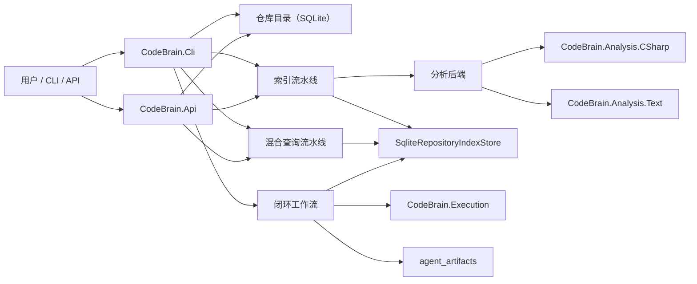
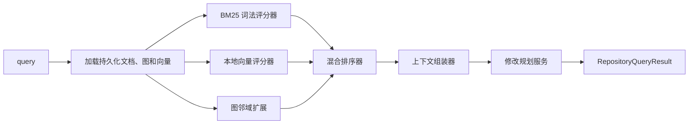
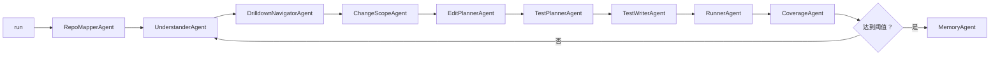

# CodeBrain 架构说明

## 总览

CodeBrain 当前有三条主要执行链路，它们共享同一套持久化仓库智能模型：

1. 索引流水线。
2. 查询流水线。
3. 闭环修改与验证流水线。

## 系统视图

## 索引流水线

关键点：

- 仓库注册会自动选择分析后端。
- `LocalFileIncrementalIndexPlanner` 在 Git 可用时优先使用 Git 状态。
- 清单会记录：
  - 分析器 ID；
  - 主语言；
  - head commit；
  - 变更检测模式；
  - 文件指纹。

## 查询流水线

混合查询结果包含：

- 排名命中项；
- 评分拆解；
- 相关符号；
- 组装后的上下文包；
- 建议的修改计划。

## 闭环工作流

这是当前修改执行闭环的实现方式：

- 通过检索和深入分析收缩可能的修改面；
- 用变更范围模型约束影响边界；
- 用编辑计划定义文件、符号与验证目标；
- 用测试生成和执行验证建议的修改路径。

## 分析后端

### `csharp-roslyn`

职责：

- 加载解决方案与项目；
- 解析符号；
- 提取调用图；
- 生成知识图谱；
- 生成 C# 检索文档。

### `text-structure`

职责：

- 发现非 C# 文件；
- 提取简单声明；
- 提取简单 import/reference；
- 生成结构图；
- 生成面向检索的文件/符号文档。

该后端目前故意保持轻量。目标是先把分析层抽象边界做稳，再引入更深入的多语言实现。

## 核心数据模型

- `RegisteredRepository`
  仓库身份信息与后端选择。
- `RepositoryIndexManifest`
  持久化索引元数据，以及 Git/文件指纹。
- `RepositoryChangeSet`
  Git 感知或文件系统感知的增量差异摘要。
- `RepositoryIndexDocument`
  检索单元，带明确的 `SearchText`。
- `RepositoryContextBundle`
  面向问答与编辑的证据包。
- `RepositoryChangeScope`
  基于图上下文推导出的受限编辑面。
- `RepositoryEditPlan`
  建议修改的文件、符号与验证动作。

## 设计说明

- 本地向量层是确定性且自包含的。它避免依赖外部 embedding 服务，同时仍然覆盖混合检索中的向量分支。
- 混合检索质量被设计成可解释的。每个命中项都会暴露 BM25、向量和图分数的贡献。
- 第二分析后端目前是结构型而非语义型，其目的首先是验证抽象边界。

## 下一步建议改进

1. 用可插拔的 embedding provider 替换当前本地向量实现。
2. 为规划器增加 Git diff 范围选择和 staged/unstaged 过滤。
3. 将混合检索拆分到独立的 `CodeBrain.Search` 项目。
4. 用感知编辑意图的测试合成替换占位式测试脚手架。
5. 将第二后端从结构解析升级到真实 AST 级别的实现。
