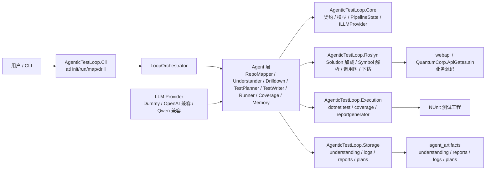
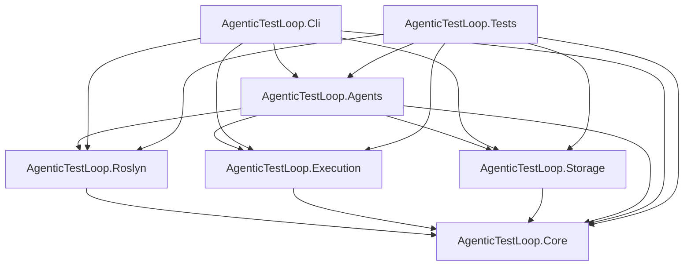
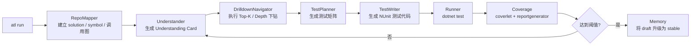

# Agentic Test Loop 架构说明

## 概览

当前仓库可以分为两个协作层：

- `webapi`：被分析、被理解、被测试的业务解决方案
- `agentic_test_loop`：负责扫描代码、生成理解、写测试、执行验证、沉淀记忆的 Agent 框架

## 总体架构

## `agentic_test_loop` 内部项目依赖图

## 闭环执行流程

## 当前边界划分

- `agentic_test_loop`：平台层
- `webapi`：业务目标层
- `agent_artifacts`：执行产物层
