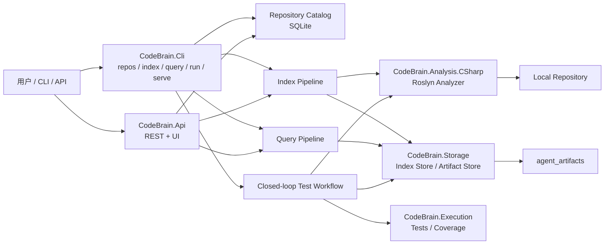
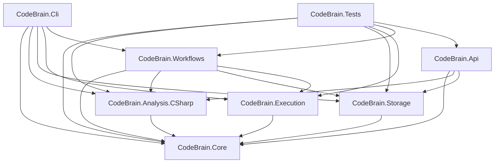
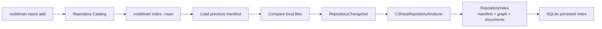
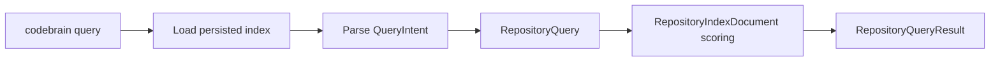
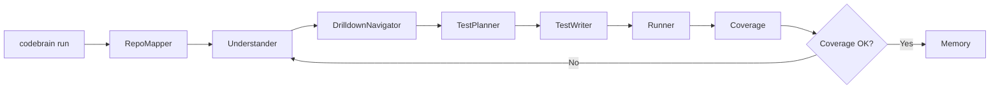

# CodeBrain 架构说明

## 概览

CodeBrain 当前包含两条并行能力链：

- 仓库智能链：本地仓库注册、增量索引、持久化索引加载、仓库检索
- 测试闭环链：理解、下钻、测试计划、测试生成、执行、覆盖率、记忆升级

## 总体架构

## 当前项目依赖图

## 索引链路

关键点：

- 只支持 `LocalPath`
- 增量索引目前是文件级
- 检索文档来自图谱节点和符号摘要
- 图谱快照和检索文档统一持久化

## 查询链路

当前支持的 `QueryIntent`：

- `CodeQa`
- `SymbolLookup`
- `ImpactAnalysis`
- `TestGeneration`
- `BugLocalization`

当前检索策略仍然是轻量规则检索，不包含向量检索。后续可以在 `IRepositoryQueryService` 背后替换为 BM25 + 向量 + 图融合检索，而不改 CLI/API 契约。

## 测试闭环链路

测试闭环仍然复用：

- Roslyn 图谱
- 理解卡片
- 测试执行与覆盖率收集
- `draft -> stable` 的记忆升级规则

## 数据模型分层

- `RegisteredRepository`
  - 仓库目录项
- `RepositoryIndexManifest`
  - 上次索引的文件指纹集合
- `RepositoryChangeSet`
  - 本次增量差异
- `RepositoryIndexDocument`
  - 检索文档
- `RepositoryIndex`
  - 持久化索引聚合
- `RepositoryQuery`
  - 查询请求
- `RepositoryQueryResult`
  - 查询结果

## 后续扩展方向

1. 增加 `IRepositoryAnalyzer` 的新 backend，实现多语言适配。
2. 在 `IRepositoryQueryService` 后增加向量检索与混合排序。
3. 在 `IRepositoryCatalog` 和 `IRepositoryIndexStore` 上增加多仓库批量查询与选择策略。
4. 将当前 C# analyzer 从“Roslyn map + graph”进一步升级为统一中间语义模型输出。
